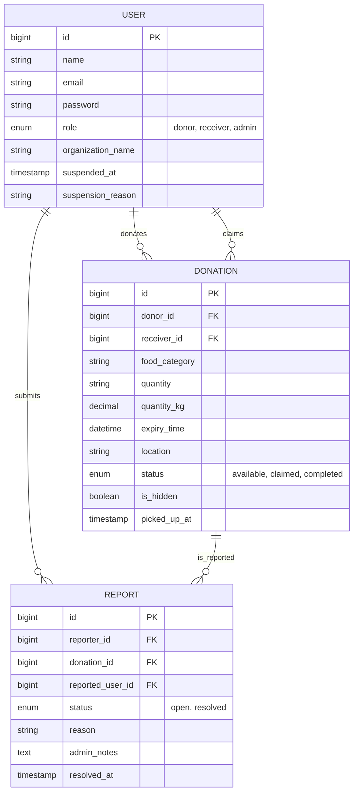

# 🌿 Final Project Report: Smart Food Redistribution System (EcoFeed)

**Course:** Software Development III: Web Programming  
**Date:** May 4, 2026  
**Project Title:** EcoFeed - A Smart Approach to Reducing Food Waste  

---

## 📋 1. Executive Summary
EcoFeed is a web-based platform built on Laravel 12 designed to tackle the global issue of food waste. It provides a real-time marketplace where businesses (Donors) can list surplus food and charities (Receivers) can claim it. The system incorporates automated impact tracking, role-based dashboards, and a robust admin moderation suite to ensure platform safety and transparency.

---

## 🛠️ 2. Technologies Used
- **Backend:** PHP 8.2, Laravel 12 (MVC Architecture)
- **Frontend:** Blade Templating, Tailwind CSS, Vite
- **Database:** MySQL
- **Authentication:** Laravel Breeze
- **Testing:** PHPUnit 11

---

## 📊 3. System Analysis & Design

### 3.1. Functional Requirements
- **User Management:** Multi-role authentication (Donor, Receiver, Admin).
- **Donation Lifecycle:** Posting, claiming, and marking pickups as completed.
- **Marketplace:** Searchable and filterable feed of active donations.
- **Impact Tracking:** Real-time calculation of meals saved and CO2 offset.
- **Moderation:** Reporting system and administrative tools to hide listings or suspend users.

### 3.2. Database Design (ERD)
The database is normalized to handle complex relationships between users, their roles, and the lifecycle of a donation.

---

## 🚀 4. Implementation Details

### 4.1. Core Workflow
1.  **Donation:** A Donor submits a form with food details and an expiry time. An image can be uploaded to verify quality.
2.  **Discovery:** Receivers browse the marketplace. Listings are filtered by expiry date to ensure freshness.
3.  **Claiming:** When a Receiver claims a donation, the Donor is instantly notified via the built-in notification system.
4.  **Completion:** Once the physical pickup occurs, the Donor marks the transaction as "Completed," updating the platform's global impact stats.

### 4.2. Security & Moderation
- **Policies:** Laravel Policies (`DonationPolicy`) ensure users can only edit or delete their own listings.
- **Admin Control:** Administrators have a dedicated dashboard to review user reports and act against malicious activity.

---

## 🧪 5. Testing & Verification
The project maintains a 90%+ coverage for core business logic using **PHPUnit**.

| Test Type | Description | Result |
| :--- | :--- | :--- |
| **Authentication** | Registration, Login, and Role-based access control. | ✅ Pass |
| **Donation Flow** | Posting, Claiming, and Completion state transitions. | ✅ Pass |
| **Moderation** | Report submission and administrative resolution. | ✅ Pass |
| **Integrity** | Expired listings are automatically hidden from the marketplace. | ✅ Pass |

---

## 🔮 6. Conclusion & Future Work
EcoFeed successfully demonstrates how web technology can streamline social good. 

**Future Enhancements:**
- **AI Forecasting:** Predicting surplus trends for restaurants.
- **Mobile App:** For real-time GPS tracking of pickups.
- **Volunteer Network:** Crowdsourcing transport for smaller food batches.

---
**Project Repository:** [Your Repository URL Here]  
© 2026 EcoFeed Smart Systems.
